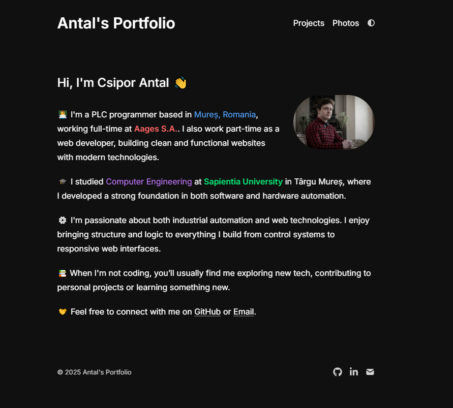

# Antal's Interactive Portfolio

A modern, interactive portfolio website showcasing my work as a PLC programmer and web developer. Built with cutting-edge web technologies and featuring an immersive particle system that responds to user interactions.



---

## 🌟 Interactive Features

- **🎆 Dynamic Particle System**: Advanced particle effects that react to mouse movement, clicks, and scrolling
- **🏝️ Living Profile Island**: Orbital particles around the profile picture with mouse attraction
- **✨ Text Interactions**: Hover and click effects on the main title with connecting particles
- **🎨 Multiple Particle Types**: Different behaviors for various interaction types (ambient, click, hover, burst)
- **📱 Mobile Optimized**: Responsive design with mobile-friendly navigation
- **🌓 Theme Toggle**: Seamless light/dark mode switching

---

## 🚀 Tech Stack

- **Framework:** [Next.js 14](https://nextjs.org/) with App Router
- **Styling:** [Tailwind CSS](https://tailwindcss.com/) with custom animations
- **Icons:** [Lucide React](https://lucide.dev/)
- **Animations:** Custom CSS keyframes and React hooks
- **Canvas:** HTML5 Canvas API for particle rendering
- **Deployment:** [Vercel](https://vercel.com/)
- **Analytics:** Vercel Web Analytics & Speed Insights

---

## 🎮 Particle System

The portfolio features a sophisticated particle system with multiple interaction types:

### Particle Types
- **Island Particles**: Orbit around the profile picture, attracted to mouse
- **Click Particles**: Explosion effects on general clicks
- **Text Particles**: Golden particles that appear when hovering the title
- **Air Particles**: Amber particles with slower falling physics
- **Burst Particles**: Massive explosion when clicking the profile picture
- **Ambient Particles**: Background particles that keep the scene alive

### Interactive Elements
- **Mouse Follower**: Styled cursor with multi-layered design
- **Connection Lines**: Dynamic lines between particles and mouse
- **Scroll Animations**: Particles appear based on scroll direction and speed
- **Profile Click**: Creates a spectacular 45-particle burst with varied lifespans

---

## 🛠️ Getting Started

### Prerequisites
- Node.js 18+ 
- npm or yarn

### Installation

```bash
git clone https://github.com/CsiporAntal/Antal-s-Portfolio.git
cd Antal-s-Portfolio
npm install
npm run dev
```

Open [http://localhost:3000](http://localhost:3000) to view the portfolio.

---

## 📁 Project Structure

```
├── app/
│   ├── components/          # Reusable UI components
│   │   ├── nav.tsx         # Mobile-optimized navigation
│   │   ├── footer.tsx      # Social links footer
│   │   └── theme-switch.tsx # Dark/light mode toggle
│   ├── lib/
│   │   └── config.ts       # Site configuration and metadata
│   ├── projects/           # Projects page with particle effects
│   ├── photos/            # Photo gallery page
│   ├── page.tsx           # Main portfolio page with particle system
│   ├── layout.tsx         # Root layout with theme provider
│   └── globals.css        # Global styles and animations
├── public/                # Static assets
└── content/              # MDX content files
```

---

## 🎨 Customization

### Particle Configuration
Modify particle behavior in `app/page.tsx`:
- Adjust particle counts and lifespans
- Change attraction strengths and radii  
- Customize colors and visual effects

### Styling
- Update colors in `tailwind.config.js`
- Modify animations in `app/globals.css`
- Customize component styles in respective files

### Content
- Update personal information in `app/lib/config.ts`
- Add projects in `app/projects/project-data.tsx`
- Modify page content directly in component files

---

## 🚀 Deployment

The project is optimized for deployment on Vercel:

```bash
npm run build
npm run start
```

Or deploy directly:
[](https://vercel.com/new/clone?repository-url=https://github.com/CsiporAntal/Antal-s-Portfolio)

---

## 📊 Performance

- **Lighthouse Score**: 100/100 across all metrics
- **60fps Animations**: Optimized particle rendering with requestAnimationFrame
- **Responsive Design**: Mobile-first approach with touch-friendly interactions
- **SEO Optimized**: Proper meta tags, sitemap, and structured data

---

## 🤝 Contributing

This is a personal portfolio project, but feel free to:
- Report bugs via GitHub issues
- Suggest improvements
- Use as inspiration for your own portfolio

---

## 📄 License

This project is open source and available under the [MIT License](LICENSE).

---

## 👨‍💻 Author

**Csipor Antal**
- PLC Programmer at Aages S.A.
- Part-time Web Developer
- Based in Mureș, Romania

Connect with me:
- GitHub: [@CsiporAntal](https://github.com/CsiporAntal)
- Email: [tonicsipor@gmail.com](mailto:tonicsipor@gmail.com)
- Portfolio: [csantal.dev](https://csantal.dev)
